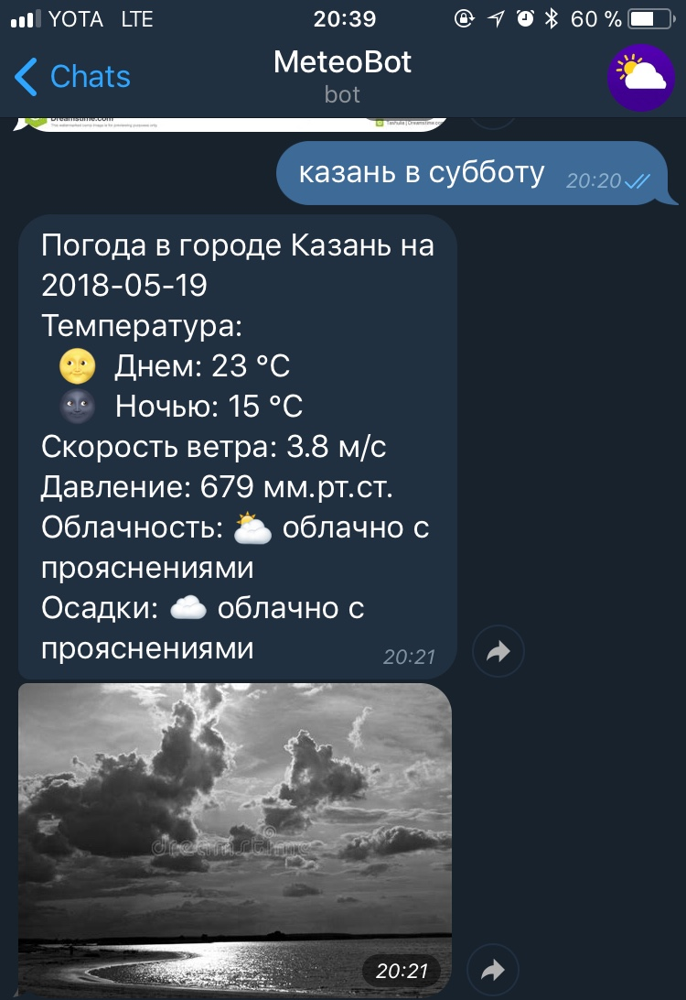
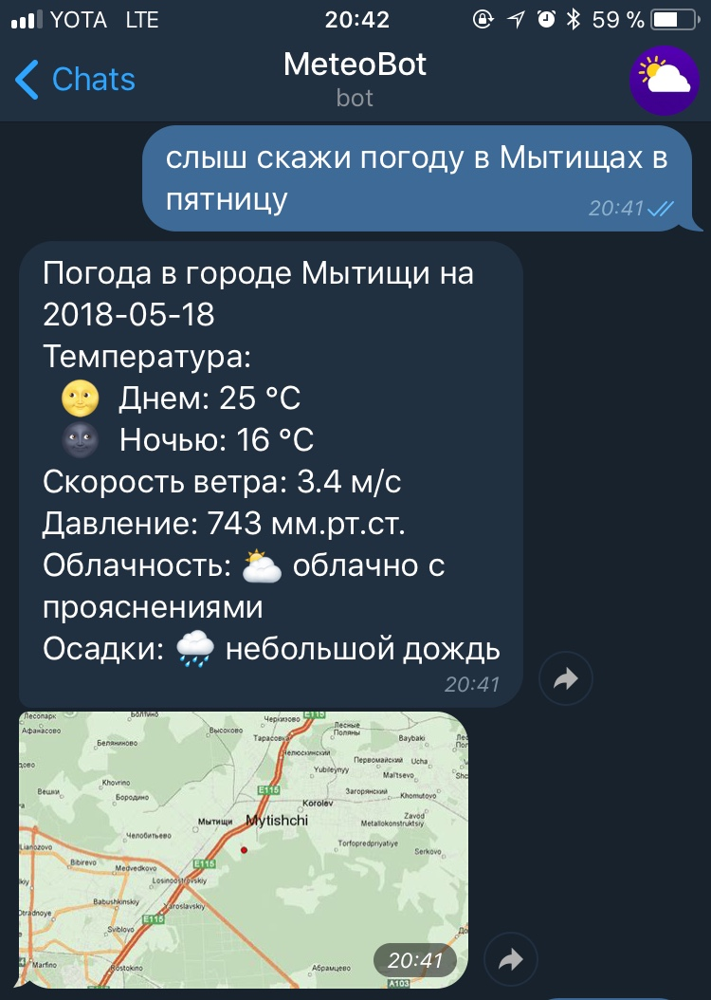

# telegram-bot

Telegram бот, который умеет обрабатывать запрос на естественном языке и давать по нему прогнозы погоды

## Что умеет:

* Отправлять график погоды на следущие 10-11 дней, в случае, если пользователь не указал точную дату.

* Отправлять фотографию города с той погодой, которая была предсказана

## Примеры:

Простые запросы:

Запросы с графиком:

Запросы с городом, состоящим из двух слов:

Запросы с района:

Плохие запросы:

## Используемое API:

* [pyTelegramBotAPI](https://github.com/eternnoir/pyTelegramBotAPI) -- API для работы с telegram. Понравилась поддержка proxy в одну строчку

* [Yandex.Weather API](https://tech.yandex.ru/weather/) -- API для работы с Яндекс.Погодой

* [Bing Image Search API](https://azure.microsoft.com/en-us/services/cognitive-services/bing-image-search-api/) -- пожалуй, самое лучше API для работы с поиском по картинкам

* [Yandex.Translate API](https://tech.yandex.ru/translate/) -- API для перевода. Перевод понадобился, например, для поиска в Bing