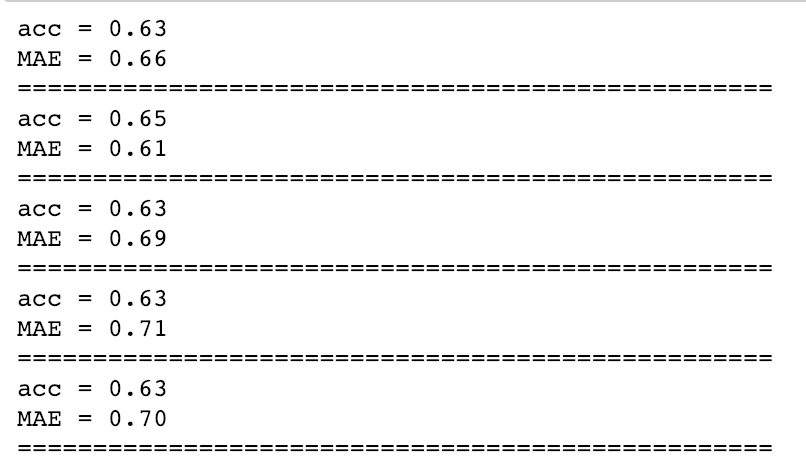
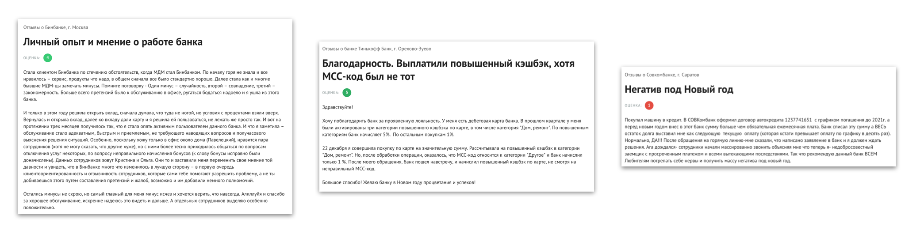
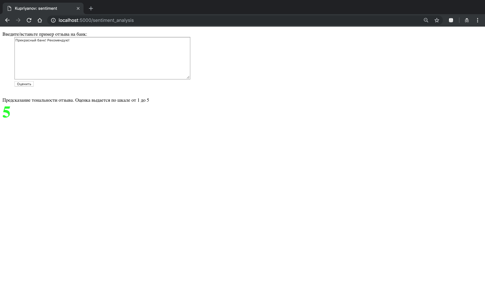
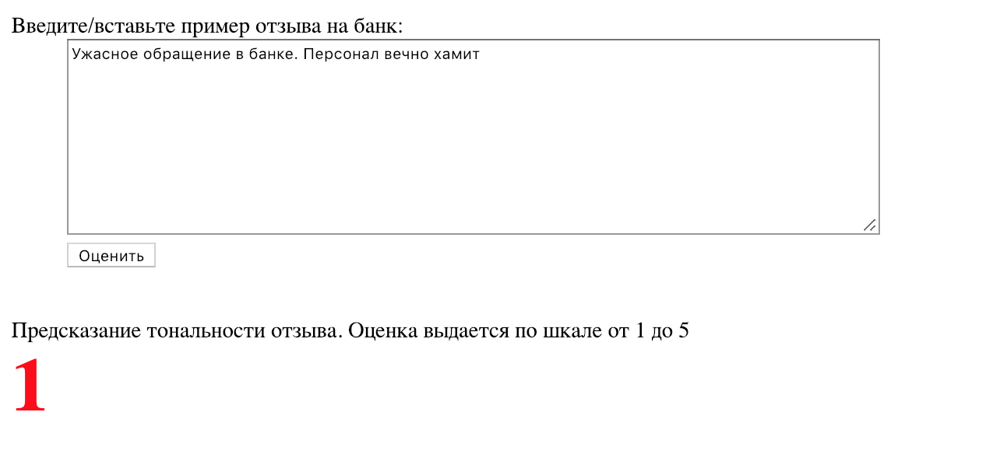
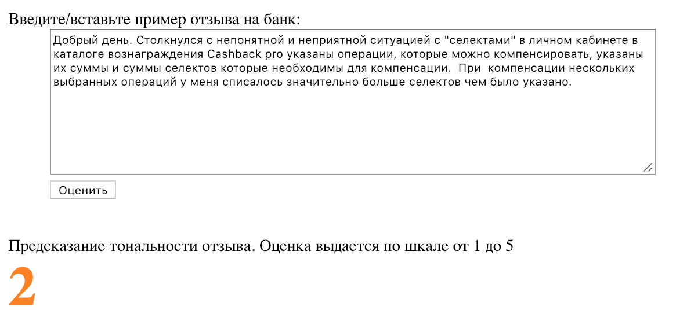
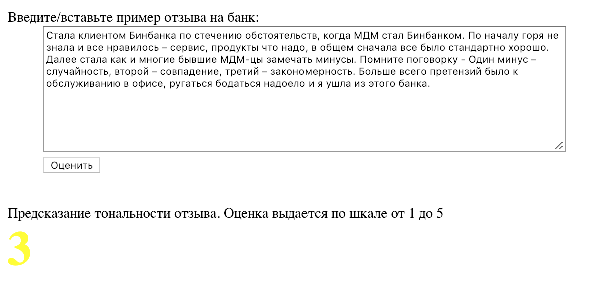
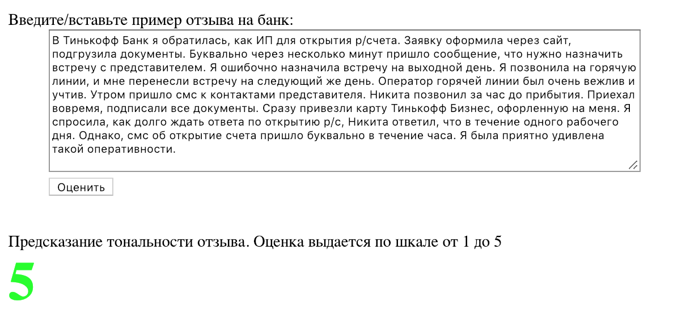

1. Формализуйте постановку задачи, ответив на вопросы: a) какая задача
будет решаться (классификация/регрессия/кластеризация/еще что-то);
 b) какими будут целевые значения (например, классы в задаче классификации) - почему именно такими, как прогнозы будут показываться в демонстрации (например: каким-то числом, текстом, цветом); c) как измерять качество, чтобы было более-менее интуитивно понятно, высокое оно или не очень, d) на каких отзывах должна работать демонстрация (язык, длина, наличие ошибок и сленга в тексте). Возможно вам потребуется частично справиться со следующим пунктом задания, чтобы постановка задачи была совместима с данными, которые вы можете достать.

**a)** Решаю задачу классификации

**b)** Классов будет 5: от 1 до 5. Они соответствуют градации от негативной до позитивной

**c)** Качество измерялось с помощью accuracy и MAE

**d)** Модель обучалась на отзывах с сайта banki.ru. Пример отзывов:

Соответственно, демонстрация должна работать на больших (см пример выше) отзывах на русском языке. Но я попытался добавить некоторое количество маленьких фраз для увеличения качества работы модели на "неформальных" текстах.

2. Соберите данные: тексты отзывов и какую-то разметку (желательно,
не менее 5000 примеров), позволяющую судить о том, какие отзывы позитивные,
а какие нет. Например, можно попробовать найти готовую выборку, либо
распарсить тексты с каких-нибудь сайтов (лучше - с помощью scrapy или
какой-то другой библиотеки, предназначенной для краулинга, но можно с помощью
 requests и какой-нибудь библиотеки для парсинга html-кода).

 Собираю данные с сайта banki.ru используя selenium webdriver, т.к. на первый взгляд banki.ru используют AJAX, и просто так scrapy завести мне не удалось. Selenium для меня достаточно знакомый инструмент, поэтому времени он занял немного. Весь код парсинга находится в ноутбуке `parsing.ipynb`

3. Постройте какую-нибудь несложную модель в Ipython Notebook с помощью
 sklearn. Не стоит слишком сильно увлекаться чисткой данных или усложнением
 модели, помните, что исходная цель - сделать простой прототип, который
  будет как-то сносно работать в большом числе случаев, но может не
  очень удачно обрабатывать сложные ситуации. Сохраните модель с помощью
  pickle или joblib, чтобы в демонстрации просто загружать обученную модель
   и vectorizer.

Обучение и построение модели `model.ipynb`. Если вкратце
я предобратывал текст с помощью библиотек nltk и pymorphy2, далее делаю tf-idf, на этом всем обучаю RandomForest.

4. Реализуйте демонстрацию работы вашего алгоритма, сделав простую
 веб-страничку, например на Flask. Логика должна быть предельно простой:
 текст отзыва вставляется в текстовое поле, пользователь нажимает
 кнопку и получает прогноз тональности. Поиграйтесь с получившейся
 демонстрацией, возьмите какие-нибудь запросы для тестирования
 и сделаете скриншоты результатов.

 Код с сервером расположен в папке `/deploy_server`

 Запуск: `python3 server.py`. Сервер крутится на 5000 порту

